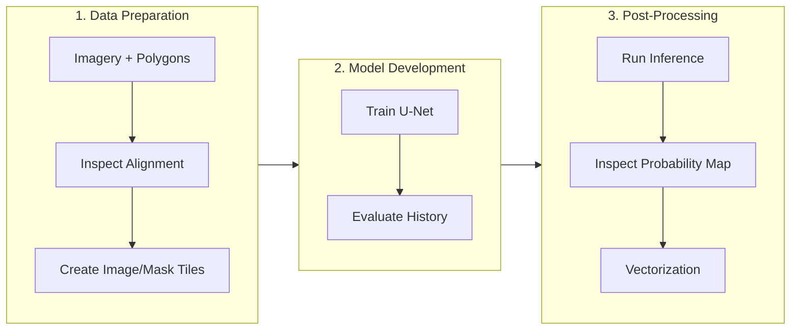

---
site:
  outline_maxdepth: 2
---

# Binary segmentation

<!-- markdownlint-disable MD033-->
<div class="page-subtitle">
Train, evaluate and apply a U-Net model for building-footprint segmentation
</div>
<!-- markdownlint-enable MD033 -->

---

You now understand what a segmentation model predicts and how it is built. This page walks through a complete binary segmentation workflow, building footprint detection, from raw data to GIS-ready vector output. The pattern you learn here repeats, with small adaptations, across the rest of this lesson.

---

## 1. Why this workflow matters

Building footprint segmentation is a clear, well-scoped binary problem (building versus background), which makes it a good vehicle for learning the full workflow before you add the complications of multiple bands (next page) or many classes (page 7). Everything from here on is a variation on this same pattern.

---

## 2. Core idea

The workflow has a consistent shape regardless of the specific target class: acquire imagery and labels, cut them into training tiles, train a U-Net model, evaluate its performance on held-out data, run inference on new imagery, and convert the raster output into usable vector features.



---

## 3. Workflow

### A. Download and inspect the data

```{code-cell} python
import geoai

train_raster_url = "https://data.source.coop/opengeos/geoai/naip_rgb_train.tif"
train_vector_url = "https://data.source.coop/opengeos/geoai/naip_train_buildings.geojson"
test_raster_url = "https://data.source.coop/opengeos/geoai/naip_test.tif"

train_raster_path = geoai.download_file(train_raster_url)
train_vector_path = geoai.download_file(train_vector_url)
test_raster_path = geoai.download_file(test_raster_url)
```

The training data is a NAIP RGB image tile paired with building footprint polygons; a separate NAIP image serves as the held-out test set.

Before training, inspect both the raster and the reference polygons.

```{code-cell} python
geoai.print_raster_info(
    train_raster_path,
    show_preview=False,
)
```

Then overlay the building footprints on the imagery.

```{code-cell} python
geoai.view_vector_interactive(
    train_vector_path,
    tiles=train_raster_path,
)
```

`view_vector_interactive()` overlays the building footprint polygons directly on the training imagery, letting you visually confirm the labels actually align with the buildings before you spend any time training. This is the segmentation equivalent of the annotation check you did for detection in L06, and just as important.

```{code-cell} python
geoai.view_raster(test_raster_path)
```

### B. Create training tiles

The large training raster is divided into overlapping patches.

```{code-cell} python
out_folder = "buildings"

tiles = geoai.export_geotiff_tiles(
    in_raster=train_raster_path,
    out_folder=out_folder,
    in_class_data=train_vector_path,
    tile_size=512,
    stride=256,
    buffer_radius=0,
)
```

`export_geotiff_tiles()` slices the training raster and rasterizes the vector labels into matching 512-by-512 pixel tiles, with a 256-pixel stride creating overlap between neighboring tiles. This overlap increases the effective training set size and helps the model learn features near tile boundaries, rather than only in tile interiors.

### C. Train the U-Net model

```{code-cell} python
geoai.train_segmentation_model(
    images_dir=f"{out_folder}/images",
    labels_dir=f"{out_folder}/labels",
    output_dir=f"{out_folder}/unet_models",
    architecture="unet",
    encoder_name="resnet34",
    encoder_weights="imagenet",
    num_channels=3,
    num_classes=2,
    batch_size=8,
    num_epochs=20,
    learning_rate=0.001,
    val_split=0.2,
)
```

`num_classes=2` reflects background and building; `num_channels=3` matches the RGB input. `encoder_weights="imagenet"` is what activates the {term}`transfer learning <Transfer Learning>` discussed on the previous page. This configuration, U-Net plus a ResNet34 encoder, is a strong default binary-segmentation baseline.

Important {term}`Hyperparameter` choices include:

- `batch_size`,
- `num_epochs`,
- `learning_rate`,
- `val_split`.

For your own project, record these settings alongside the resulting model {term}`Checkpoint`.

### D. Evaluate the model

```{code-cell} python
geoai.plot_performance_metrics(
    history_path=f"{out_folder}/unet_models/training_history.pth",
    figsize=(15, 5),
)
```

This plots training and validation loss alongside {term}`IoU <Intersection over Union (IoU)>`, {term}`F1-score`, {term}`precision <Precision>`, and {term}`recall <Recall>` over training epochs, and prints a short summary of the best and final values for each. A healthy run shows both {term}`loss <Loss Function>` curves decreasing together, with validation loss tracking training loss closely; a growing gap between the two is the classic sign of {term}`overfitting <Overfitting>`, where the model memorizes training examples rather than learning patterns that generalize.

```{admonition} Read the gap, not just the numbers
:class: important
A final validation IoU of 0.90 sounds strong on its own, but check the loss curves too. If validation loss started rising while training loss kept falling, that 0.90 may reflect an earlier, better {term}`checkpoint <Checkpoint>` rather than the final one, which is exactly why `geoai` saves the *best* checkpoint separately from the final one.
```

### E. Run inference

```{code-cell} python
masks_path = "naip_buildings_prediction.tif"
probability_path = "naip_test_probability_map.tif"
model_path = f"{out_folder}/unet_models/best_model.pth"

geoai.semantic_segmentation(
    input_path=test_raster_path,
    output_path=masks_path,
    model_path=model_path,
    architecture="unet",
    encoder_name="resnet34",
    num_channels=3,
    num_classes=2,
    window_size=512,
    overlap=256,
    batch_size=4,
    probability_path=probability_path,
)

geoai.view_raster(masks_path, nodata=0, colormap="binary", basemap=test_raster_path)
```

Note that inference runs on `test_raster_path`, the held-out image the model never saw during training or validation, not on the training imagery itself. Passing `probability_path` additionally saves the per-class probability map introduced on the previous page, useful here for checking how confident the model is near building edges.

### F. Inspect masks and uncertainty

Display the predicted building mask over the original imagery.

```{code-cell} python
geoai.view_raster(
    masks_path,
    nodata=0,
    colormap="binary",
    basemap=test_raster_path,
)
```

For the two-class model, the second probability-map band represents the building class.

```{code-cell} python
geoai.view_raster(
    probability_path,
    indexes=[2],
    basemap=test_raster_path,
)
```

Inspect building edges, small structures, narrow gaps, shadows, visually similar non-building surfaces and tile-boundary regions. Intermediate probability values near boundaries can indicate locations where the class decision is less clear.

A predicted building mask can contain both types of pixel-level error.

A {term}`False Positive` occurs where background pixels are predicted as building. Potential causes include bright paved surfaces, shadows and roof-like textures or limited background variation during training.

A {term}`False Negative` occurs where real building pixels are missed. Potential causes include very small buildings, unusual roof materials, low contrast, partial occlusion, or inconsistent reference labels.

Look across several areas rather than drawing conclusions from one visually appealing example.

### G. Vectorize and filter the predictions

```{code-cell} python
output_vector_path = "naip_buildings_prediction.geojson"

gdf = geoai.orthogonalize(
    masks_path,
    output_vector_path,
    epsilon=2,
)

gdf_props = geoai.add_geometric_properties(gdf, area_unit="m2", length_unit="m")
gdf_filtered = gdf_props[(gdf_props["area_m2"] > 10)]

geoai.create_split_map(
    left_layer=gdf_filtered,
    right_layer=test_raster_path,
    left_args={"style": {"color": "red", "fillOpacity": 0.2}},
    basemap=test_raster_path,
)
```

{term}`Orthogonalization` converts the raw raster mask into vector polygons and regularizes their edges into clean, right-angled shapes, which better represents how buildings actually look than the slightly jagged outlines a raw raster-to-vector conversion would produce. `add_geometric_properties()` then computes area and perimeter for each polygon, which is what lets you filter out very small, likely spurious detections (`area_m2 > 10` here) before treating the output as a finished result.

---

## 4. Python reactivation

`f"{out_folder}/unet_models/best_model.pth"` is an f-string building a path by inserting a variable into a larger string, the same pattern used throughout this workflow to keep related outputs organized under one folder. `gdf_props[(gdf_props["area_m2"] > 10)]` is boolean indexing on a GeoDataFrame: the condition inside the brackets produces `True`/`False` for every row, and only the `True` rows are kept, the same filtering pattern you have used on DataFrames in earlier lessons.

---

## 5. Common pitfalls

- **Skipping the label-alignment check in step A.** Training on misaligned labels produces a model that learns a systematically wrong offset, which is easy to miss until you inspect predictions and hard to fix after the fact.
- **Forgetting `num_classes` includes background.** A binary task is `num_classes=2`, not `1`, the same convention as the detection lesson.
- **Evaluating only the summary numbers, not the loss curves.** A single best-IoU number does not tell you whether the model was still improving, had plateaued, or had already started overfitting by that point.
- **Treating the raw raster mask as the finished deliverable.** For most GIS uses, the vectorized, filtered, and orthogonalized output in step F is what you actually want to share or analyze further.

---

## 6. Mini task

Before changing any model settings, inspect the building workflow and identify:

1. one possible source of false-positive building pixels,
2. one possible source of false-negative pixels,
3. one reason the 512/256 tiling strategy may help,
4. one reason a spatially separate test area is valuable.

:::{note} Sample solution
:class: dropdown

Possible answers include:

1. **False positive:** a bright paved structure or roof-like texture is labelled as building.
2. **False negative:** a small or unusual roof is missed.
3. **Overlap:** a building close to one tile edge appears more centrally in another overlapping tile.
4. **Spatial test area:** it checks whether the model transfers beyond the exact spatial patterns present in training.

:::

---

## 7. Key takeaways

- The core segmentation workflow, tiles, train, evaluate, infer, vectorize, stays the same across binary tasks; only the specific class and data change.
- `num_classes=2` for binary segmentation includes background as one of the two classes.
- A widening gap between training and validation loss signals overfitting; `geoai` addresses this by saving the best checkpoint separately from the final one.
- Orthogonalization and geometric-property filtering turn a raw raster mask into a clean, GIS-ready vector deliverable.
- Always run inference and evaluation on held-out imagery the model never saw during training.

### Further reading

- OpenGeoAI, ["Train Segmentation Model"](https://opengeoai.org/examples/train_segmentation_model/) — the full, runnable notebook this workflow is based on.
- SpaceNet, [news and resources](https://spacenet.ai/news-resources/) — background on one of the best-known building-footprint benchmark programs in remote sensing, useful if you want additional building-segmentation data for a project.
- [GeoAI Tutorial 19: Train a Segmentation Model for Object Detection from Remote Sensing Imagery](https://youtu.be/l8DY166eAWI) — a video walkthrough covering a similar end-to-end workflow.
